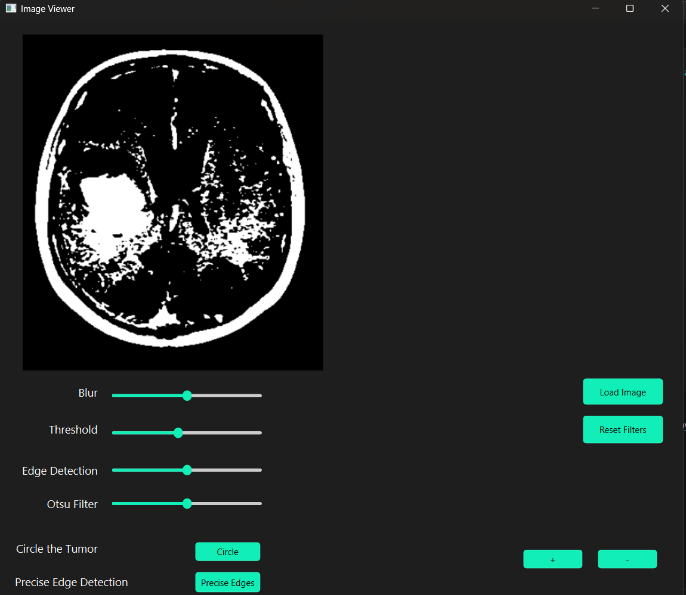

# Medical Image Filtering App

A web-based application for applying various image processing filters to medical images (e.g., X-rays, MRIs, CT scans). This tool is designed to assist medical professionals and researchers by enhancing image quality and highlighting critical features in the images.

## Features

- Upload medical images (JPG, PNG, etc.)
- Apply various image filters:
  - Gaussian Blur
  - Edge Detection
  - Precise Edge Detection
  - Threshold
  - Otsu Filter
  - Circle Tumor (Experimental – may not work properly on all images)
- Real-time preview of filtered results
- Easy-to-use and responsive GUI (built with Qt Designer)
- Reset Filters if desired

## Usage

### Prerequisites

- Python 3.7 or higher must be installed on your system.

### Installation and Running

1. Clone the repository:

   ```bash
   git clone https://github.com/ranadik/Medical-Image-Filtering-App.git

2. Navigate to the project directory:

   ```bash
   cd Medical-Image-Filtering-App/medimg_app

3. Install the required dependencies:
   
   ```bash
   pip install -r requirements.txt

4. Run the application:

   ```bash
   python main.py

5. Use the GUI to upload a medical image and apply the filters you want.

## Screenshots

### Edge Detection


### Threshold


### Blur


### Zoom In


### Circle Tumor


### Precise Edge Detection


## Contributing

Feel free to fork the repo and submit pull requests. Bug reports and suggestions are welcome!
